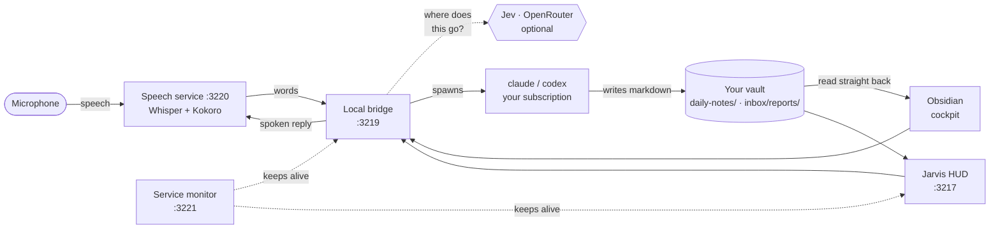

<div align="center">

<pre>
  █████╗  ██████╗ ███████╗███╗   ██╗████████╗██╗ ██████╗      ██████╗ ███████╗  ██╗   ██╗██████╗ 
 ██╔══██╗██╔════╝ ██╔════╝████╗  ██║╚══██╔══╝██║██╔════╝     ██╔═══██╗██╔════╝  ██║   ██║╚════██╗
 ███████║██║  ███╗█████╗  ██╔██╗ ██║   ██║   ██║██║          ██║   ██║███████╗  ██║   ██║ █████╔╝
 ██╔══██║██║   ██║██╔══╝  ██║╚██╗██║   ██║   ██║██║          ██║   ██║╚════██║  ╚██╗ ██╔╝██╔═══╝ 
 ██║  ██║╚██████╔╝███████╗██║ ╚████║   ██║   ██║╚██████╗     ╚██████╔╝███████║   ╚████╔╝ ███████╗
 ╚═╝  ╚═╝ ╚═════╝ ╚══════╝╚═╝  ╚═══╝   ╚═╝   ╚═╝ ╚═════╝      ╚═════╝ ╚══════╝    ╚═══╝  ╚══════╝
</pre>

**An AI command center that lives in your Obsidian vault, in a browser HUD, and in your voice.**
Runs on **your** Claude Code and/or Codex subscription. Everything local, on `127.0.0.1` only.

[](#install--let-your-coding-agent-do-it)
[](#what-you-need)
[](#what-you-need)
[](#what-you-get)
[](#voice)
[](#what-you-need)

</div>

<!-- ───────────────────────────────────────────────────────────────────────────
     SCREENSHOTS GO HERE.  Drop PNGs into  docs/assets/  and uncomment:

     <div align="center">
     
     <sub>The Jarvis HUD at 127.0.0.1:3217 — the whole system on one screen.</sub>
     </div>

     Keep each image under 5 MB (the export's leak scan rejects anything larger)
     and make sure the vault on screen is a demo vault, not a real one — the
     scanner cannot read inside images.
─────────────────────────────────────────────────────────────────────────── -->

<br/>

## Install — let your coding agent do it

Open **Claude Code** or **Codex**. There are two starting points: a first installation, or an upgrade to the Agentic OS you already use. If you just say "set this up," the agent asks which you mean.

### First installation

Say:

```
Clone https://github.com/ctskool/agentic-os-starter-v2 into ~/agentic-os and set it up for me.
```

The agent reads `CLAUDE.md` / `AGENTS.md`, follows `setup/PLAYBOOK.md`, and walks you through prerequisites, your vault, optional voice and Jev, the clicks in Obsidian, dashboard personalization, and a final test run. Keys are typed into a local page, never into chat. A first install usually takes 15–25 minutes, most of it downloads. You can use an Obsidian vault you already have.

### Already use Agentic OS?

Say:

```text
Use https://github.com/ctskool/agentic-os-starter-v2 to help upgrade the Agentic OS I already use. Find my installation and vault, explain what I can add, and preserve my customizations. Show me the plan before changing my setup.
```

The agent starts by finding your existing installation and vault. You should not need to know their paths; if it finds several, it asks which vault you use. Then it explains available features and recommends compatible changes. You can ask for particular capabilities, such as personal skill buttons or voice, while keeping the parts you have customized. Some changes need matching bridge, plugin and HUD versions, so the agent checks the code before promising they fit.

```text
Find your system -> choose improvements -> review plan -> apply and test
```

A stock V2 starter can be updated as a complete release. V1 can move to V2 using the same vault. A customized project needs an integration plan and focused implementation; there is no universal automatic merge. Your agent asks before interrupting your running system and keeps a rollback route. See [Upgrading an existing system](docs/UPGRADING.md).

> [!NOTE]
> **Codex users:** allow the session to install software and use the network when it asks. The default sandbox cannot do an install.

### What you need

| | |
|---|---|
| A Claude Code **or** Codex subscription, signed in on this computer | one is enough, both is best |
| [Obsidian](https://obsidian.md) | free |
| Node.js 22+, Git, Python 3.10–3.13 (for voice) | the agent installs what is missing |
| About 3 GB of disk, 8 GB of RAM | voice is about 1.3 GB of that |
| Optional: an [OpenRouter](https://openrouter.ai) key with a few dollars of credit | for Jev |

Windows 10/11 and macOS.

> [!WARNING]
> **macOS is new (beta).** The install and the background services are checked automatically on a Mac; the microphone, Obsidian and the HUD have had far less real-world use there than on Windows, so reports are welcome. Known gaps: no global push-to-talk hotkey (use the microphone button) and the Claude weekly-usage meter may read "unavailable".

### Prefer to do it by hand?

```bash
git clone https://github.com/ctskool/agentic-os-starter-v2 ~/agentic-os
cd ~/agentic-os
node aos.mjs setup --vault "/absolute/path/to/your/vault" --voice yes --autostart yes
node aos.mjs jev-key          # optional
```

Then open the vault in Obsidian (*Open folder as vault*), choose **Trust author and enable plugins** (an existing vault: enable the **Agentic OS V2** community plugin), and open <http://127.0.0.1:3217>. Setup's checklist shows `WAIT Plugin switched on in Obsidian` until you have done that. Finish with the full test:

```bash
node aos.mjs doctor --full
```

Pointing it at an **existing Obsidian vault is fine** — nothing you already have gets overwritten, and your `.obsidian/` settings are left alone. Missing template folders are added, and that is all.

<br/>

## What you get

| | | |
|:--|:--|:--|
| 🛸 **The Obsidian cockpit** | Today's plan, Top 3, metrics and one-click workflows — Plan Today, Morning Intel, Inbox Brief, Weekly Review, Deep Research, Content Cascade and more. Each bundled workflow writes its report into your vault as plain markdown you can read and edit. | `obsidian-v2/` |
| 🖥️ **The Jarvis HUD** | The same system as a full-screen dashboard at `127.0.0.1:3217`, with live terminals for Claude Code and Codex, a provider switch, system vitals and your weekly-usage meter. | `jarvis-v2/` |
| 🎙️ **Voice** | Hold the microphone and ask. Speech recognition and the spoken reply both run on your machine (Whisper + Kokoro) — no speech API keys, no audio leaves the computer. | `obsidian-v2/` |
| ⚡ **Jev** *(optional)* | A tiny routing model on OpenRouter that decides where a spoken request goes, so answers start in about a fifth of a second instead of five. Everything still works without it, only slower. | `aos.mjs jev-key` |
| 🩺 **The doctor** | `node aos.mjs doctor --full` checks every layer — services, plugin, providers, voice round-trip — and runs one real workflow end to end. Every failure names its own fix. | `aos.mjs doctor` |
| ♻️ **A service monitor** | Keeps the bridge and the HUD alive, and can start the whole thing when you log in. One copy per computer, by design. | `aos.mjs autostart` |

<br/>

## How the pieces talk

Files are the message bus. Nothing here needs a database or a server you have to babysit.



1. You click a button in the cockpit, type in a HUD terminal, or hold the microphone and talk.
2. The bridge decides what you meant — with Jev's help if you added a key — and spawns `claude` or `codex` on **your** subscription.
3. Bundled workflows write their deliverables into your vault as markdown. The cockpit and the HUD read it straight back out of the files.
4. The monitor keeps the bridge and HUD running, and restarts them if they fall over.

The daily-note format is a **frozen parser contract** (`system/schemas/daily-note.md`, v1). The cockpit parses those exact headings — customise the content, not the section names.

<br/>

## Voice

Hold the microphone in the HUD (or the cockpit) and speak. Recording stops when you pause.

| | |
|:--|:--|
| **Ask about your own stuff** | *"What's on my schedule today?"* · *"Open the morning intel."* Answered from files that already exist — your daily note, the latest brief — so it comes back fast. |
| **Hand off real work** | *"Go research what changed in Claude Code this week."* Spawns a background run on your subscription, keeps working while you do, then tells you when the report has landed. |
| **Everything stays local** | Speech recognition (Whisper) and the voice itself (Kokoro) run on your computer. No speech API keys, and no audio ever leaves the machine. |

**Jev** is the optional part. It is a small, cheap model on OpenRouter whose only job is deciding *where* a request should go, which is why answers start in a fraction of a second. Add a key with `node aos.mjs jev-key` — a local page opens in your browser and you type it there, never into a chat.

<br/>

## Day to day

| Command | What it does |
|:--|:--|
| `node aos.mjs status` | what is running |
| `node aos.mjs doctor` | PASS / FAIL / WAIT / SKIP checks, a voice round-trip included; each failure with its fix |
| `node aos.mjs doctor --full` | the above, plus one real workflow on your subscription |
| `node aos.mjs stop` | stop the services. Refuses while a conversation is open (see below) |
| `node aos.mjs start` | start them again |
| `node aos.mjs upgrade` | discover existing installations and vaults; report only, without applying changes |
| `node aos.mjs update` | update a recognized stock starter and rebuild; refuses customized or unknown source before stopping services |
| `node aos.mjs jev-key` | add or replace your OpenRouter key, via a local page |
| `node aos.mjs autostart on\|off` | start everything at login, or stop doing that |

`stop` never throws away work. If a conversation is still open it changes nothing and says `Stop active tasks in Terminals first. No service was stopped.` Close that conversation's tab in the HUD (the × ends it) or in Obsidian, then run `stop` again.

Something broken? Open this folder in your coding agent and say **"run the doctor"**. See also [`docs/TROUBLESHOOTING.md`](docs/TROUBLESHOOTING.md).

`upgrade` and `update` do different jobs. Use **upgrade** when you want your agent to find and assess an existing system; use **update** for an approved whole-release update to an unmodified starter. A customized integration may need manual future upgrades.

### Make the dashboard yours

During setup, your agent offers to wire your own skills into the button section of both dashboards. Tell it what you want those buttons to do: it can connect existing skills, help you create a missing skill, and recommend a useful starting selection. Keep the starter buttons or approve up to ten of your own choices. Both the Obsidian cockpit and the HUD use your saved order.

Use **Customize dashboard** in either app to change the selection later. Included workflows run in the background and save reports; your own installed skills open a normal Claude Code or Codex conversation so you can answer questions and handle approvals. Finding a skill does not automatically install its dependencies or connect its accounts.

Your choices stay in your vault through updates. See [Dashboard personalization](docs/DASHBOARD.md) for installed skills and agent commands.

<br/>

## What it costs

Your Claude and/or Codex account handles the thinking under your provider plan. Optional Jev routing uses paid OpenRouter requests; its cost depends on your selected model and usage. Local speech has no API charge. Your own skills may use additional paid tools or services; review their requirements before connecting them.

## What it will and will not do

The bundled workflows read your vault, the web and (if you connect them) your calendar and mail, and write **drafts and reports into your vault**. They are instructed not to send messages, publish, schedule posts or delete notes.

Your own skills run in an interactive Claude Code or Codex conversation and follow that skill's instructions and your agent's permissions. Review what a skill can do before adding it, including any external actions, accounts and services it uses.

Requests to your own Claude / Codex account can include note content a workflow reads. Web searches and connected tools also contact their respective services. Only if you add an OpenRouter key, Jev routing sends: the words you said, the last two turns of that voice conversation, the title and last few lines of the conversation you have selected, and the file names of recent reports, so it can decide where the request goes. Jev routing does not send your full notes, daily note or metrics to OpenRouter. Speech recognition and the voice itself stay on your computer. Your own skills may send data to other services according to the tools and accounts you enable.

<br/>

## Layout

```
aos.mjs            the one command
setup/PLAYBOOK.md  what the installing agent follows
setup/UPGRADE.md   discovery, upgrade choices and preserving customizations
obsidian-v2/       the local bridge, the Obsidian plugin, workflows, voice service, vault template
jarvis-v2/         the HUD (Next.js)
docs/              troubleshooting, optional settings
```

Ports, all on `127.0.0.1` and nowhere else: **3217** HUD · **3218** preview · **3219** bridge · **3220** speech · **3221** monitor.

> [!IMPORTANT]
> Only one copy of this system runs on a computer, because those ports are fixed. If you already have an installation, let your agent identify it and plan the handoff before starting another. `node aos.mjs upgrade` helps find it without stopping anything. A service interruption needs your approval; your agent should use the existing installation's own scripts and leave unrelated speech services alone.

<br/>

---

<div align="center">
<sub>Coming from the first starter kit? Ask for an upgrade. Keep the same vault and old plugin until V2 is verified, then approve the handoff.</sub>
</div>
