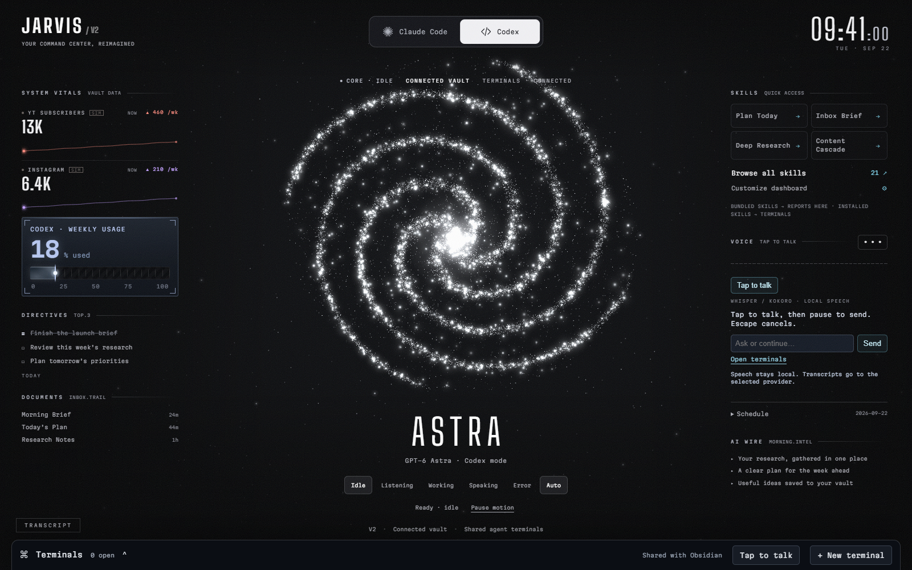
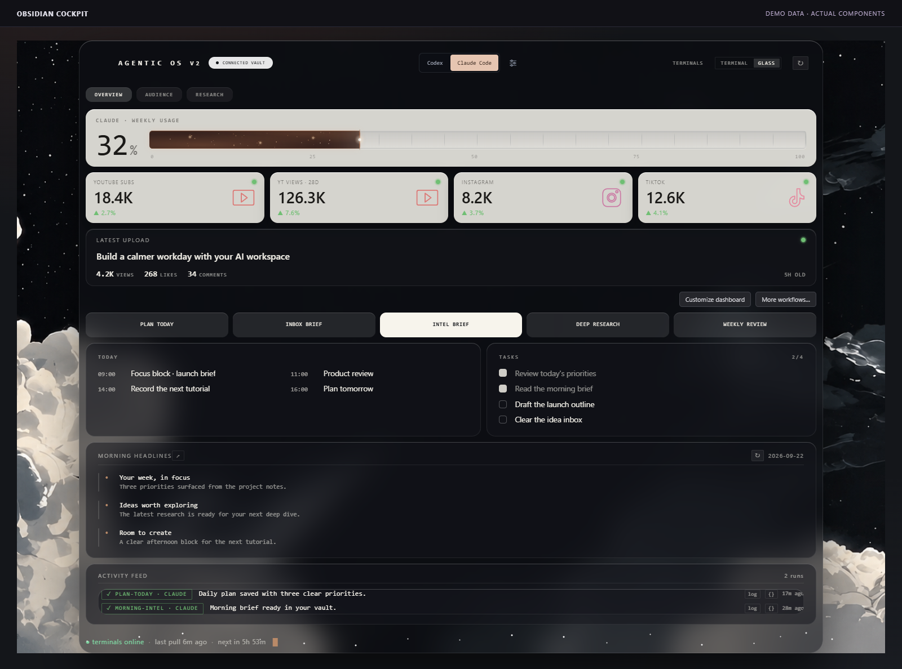

# Agentic OS V2

**Your AI command center in Obsidian — powered by Claude Code, Codex, and Jev.**

Plan your day, talk to your agents, run your favorite skills, and keep the results in your vault. Use the Obsidian cockpit or the Jarvis HUD: two views of the same system.

| Jarvis HUD | Obsidian cockpit |
|:--:|:--:|
| [](docs/assets/jarvis-hud.png) | [](docs/assets/obsidian-cockpit.png) |

*Actual dashboard components, shown with demo data. Click either image to enlarge.*

## Install

Open **Claude Code** or **Codex** and paste one of these prompts.

### First installation

```text
Clone https://github.com/ctskool/agentic-os-starter-v2 into ~/agentic-os and set it up for me.
```

Your agent walks you through missing software, choosing or creating a vault, optional voice and Jev, enabling the Obsidian plugin, and testing the setup. Allow installation and network access when prompted.

It also helps you choose **up to ten dashboard buttons**: keep the starter workflows, connect your own skills, or create new ones. Your choices appear in both dashboards.

### Already use Agentic OS?

```text
Use https://github.com/ctskool/agentic-os-starter-v2 to help upgrade the Agentic OS I already use. Find my installation and vault, explain what I can add, and preserve my customizations. Show me the plan before changing my setup.
```

You do not need to know your installation's path. The agent helps find it, recommends compatible improvements, and asks before interrupting your running system. Customized setups get an integration plan. [How upgrades work →](docs/UPGRADING.md)

### What you need

- **Claude Code or Codex**, signed in with a plan that supports it. One is enough.
- **[Obsidian](https://obsidian.md)** and a new or existing vault.
- **Node.js 22+ and Git**, plus **Python 3.10–3.13** for voice. Your agent helps install missing software.
- About **3 GB of disk space and 8 GB of RAM**. Local voice accounts for roughly 1.3 GB of downloads.
- Optional: an **[OpenRouter](https://openrouter.ai) key** for Jev. Enter it in the local setup page, never chat.

## What you get

| Feature | What it does |
|---|---|
| **Obsidian cockpit** | Your daily plan, Top 3 priorities, schedule, metrics, and one-click workflows. Reports stay in your vault as editable Markdown. |
| **Jarvis HUD** | A full-screen browser dashboard with Claude Code and Codex terminals, provider switching, system vitals, and usage meters. |
| **Your skill buttons** | Starter workflows such as Plan Today, Morning Intel, and Deep Research, plus your own skills. Change them later with **Customize dashboard**. |
| **Local voice** | Click the microphone or use the shortcut, speak, then pause. Whisper transcribes; Kokoro speaks the reply. |
| **Jev** | Helps route eligible voice requests to the right destination. |
| **Health checks and autostart** | A doctor to diagnose problems, a monitor to recover services, and optional startup at login. |

With this installation's own voice service enabled, use **Control–Option–J** on Mac or **Ctrl–Alt–J** on Windows. On Mac, keep the Obsidian orb enabled or the HUD visible. [Voice setup and permissions →](docs/MAC-VOICE.md)

## How it works

[](docs/assets/architecture.svg)

You ask or click. The bridge coordinates the work, your chosen agent carries it out, and the dashboards read the results from your vault.

### What Jev adds

Jev is an optional router: it helps decide where a spoken request should go, reducing routing delay for supported requests. **Claude Code or Codex still does the work.** Voice works without Jev.

Speech recognition and speech generation run locally. AI requests use your provider account; Jev sends request text and limited context to OpenRouter and is billed separately. Personal skills can use additional services. [Data and costs →](docs/REFERENCE.md#data-and-costs)

## Help and customization

Ask your coding agent to **“run the doctor”** if something is not working.

[Dashboard skills](docs/DASHBOARD.md) · [Upgrading](docs/UPGRADING.md) · [Mac voice](docs/MAC-VOICE.md) · [Troubleshooting](docs/TROUBLESHOOTING.md) · [Commands and reference](docs/REFERENCE.md)
