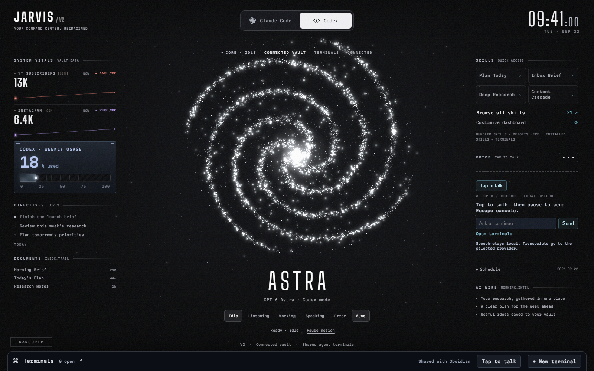
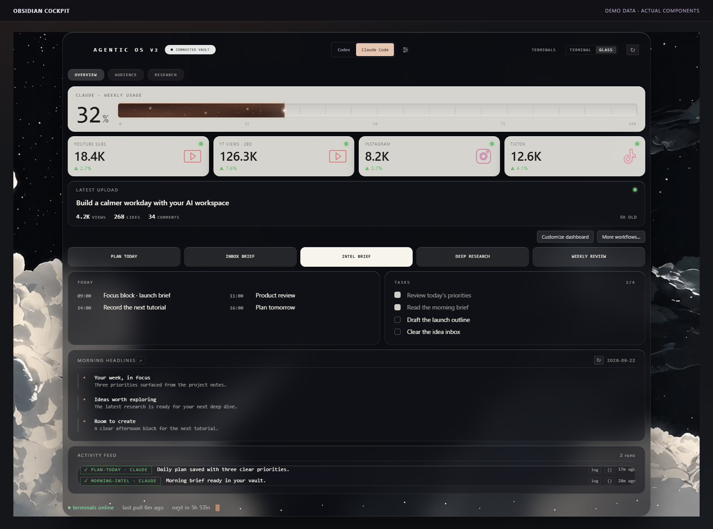
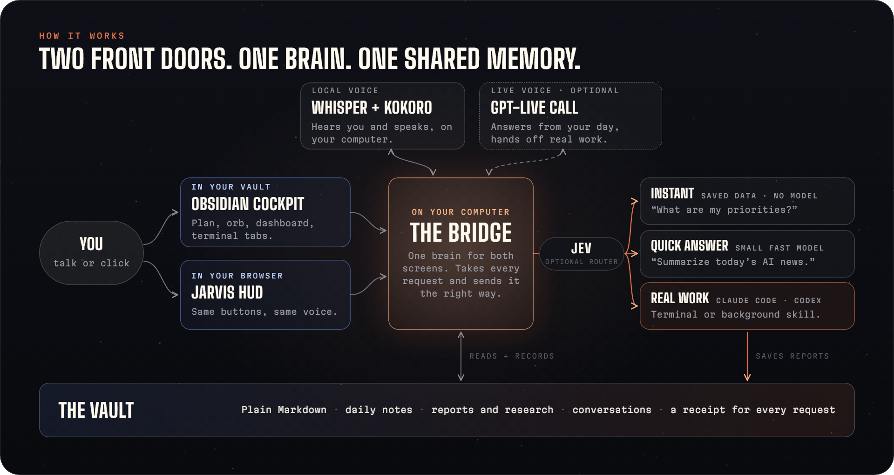

<div align="center">

# Agentic OS V2

### Your AI command center, inside Obsidian

Plan your day, talk to your agents, and run your skills from one place. Everything they produce lands in your vault as plain Markdown.

<p>


<a href="LICENSE"></a>
</p>

**[Install](#install)** &nbsp;·&nbsp; **[What you get](#what-you-get)** &nbsp;·&nbsp; **[Talk to it](#talk-to-it)** &nbsp;·&nbsp; **[How it works](#how-it-works)** &nbsp;·&nbsp; **[Help](#help)**

<a href="docs/assets/jarvis-hud.png"></a>

<sub>The Jarvis HUD. Actual dashboard components, shown with demo data.</sub>

</div>

<br>

## Install

Open **Claude Code** or **Codex** and paste this:

```text
Clone https://github.com/ctskool/agentic-os-starter-v2 into ~/agentic-os and set it up for me.
```

Your agent does the rest, and asks before each step that needs you:

1. **Checks your computer** and helps install anything missing.
2. **Sets up your vault.** Use a new one or the Obsidian vault you already have. No note in it is overwritten.
3. **Installs and proves it works.** A built-in doctor runs a real workflow and shows a pass or a fix for every check.
4. **Makes it yours.** Tell it about you, pick up to ten dashboard buttons from the starter workflows or your own skills, and choose whether you want voice.

Allow installation and network access when your agent asks.

<details>
<summary><b>Already use Agentic OS? Upgrade instead</b></summary>

<br>

```text
Use https://github.com/ctskool/agentic-os-starter-v2 to help upgrade the Agentic OS I already use. Find my installation and vault, explain what I can add, and preserve my customizations. Show me the plan before changing my setup.
```

You do not need to know your installation's path. The agent finds it, recommends compatible improvements, and asks before interrupting your running system. Customized setups get an integration plan. [How upgrades work](docs/UPGRADING.md)

</details>

<details>
<summary><b>What you need</b></summary>

<br>

| Requirement | Details |
|---|---|
| **A coding agent** | Claude Code or Codex, signed in with a plan that supports it. One is enough. |
| **Obsidian** | [Obsidian](https://obsidian.md) and a new or existing vault. |
| **Runtimes** | Node.js 22+ and Git. Python 3.12 (3.10 to 3.13) for voice and for conversations inside Obsidian. Python 3.14 is not supported by the voice libraries yet. Your agent helps install what is missing. |
| **Space** | About 3 GB of disk and 8 GB of RAM. Local voice accounts for roughly 1.3 GB of downloads. |
| **Optional keys** | An [OpenRouter](https://openrouter.ai) key for Jev, and an OpenAI API key for Live voice. You type them into a local setup page, never into chat. |

</details>

## What you get

<table>
<tr>
<td width="55%">
<a href="docs/assets/obsidian-cockpit.png"></a>
</td>
<td>

**Two screens, one system**

The **Obsidian cockpit** lives in your vault: today's plan, your top three priorities, schedule, metrics, and one-click workflows.

The **Jarvis HUD** is a full-screen dashboard in your browser, with Claude Code and Codex terminals, provider switching, and usage meters.

Both read the same vault, so a report you start in one shows up in the other.

</td>
</tr>
</table>

| Feature | What it does |
|---|---|
| **Your skill buttons** | Starter workflows such as Plan Today, Morning Intel, and Deep Research, plus your own skills. Change them any time with **Customize dashboard**. [Dashboard skills](docs/DASHBOARD.md) |
| **Reports you can edit** | Results are saved in your vault as Markdown, so you can open, edit, and link them like any other note. |
| **Claude Code and Codex** | Switch between them with one click. Each keeps its own conversations. |
| **Voice** | Speak a request on either screen. Local voice runs on your computer. Live voice is an optional real-time call. |
| **Jev** | An optional router that helps send eligible voice requests to the right place. |
| **Health checks and autostart** | A doctor that diagnoses problems and names the fix, a monitor that restarts services, and optional startup at login. |

## Talk to it

| | Local voice | Live voice |
|---|---|---|
| **What it is** | Click the microphone or use the shortcut, speak, then pause. | A two-way call with an assistant that answers from your day and hands real work to your agents. |
| **Runs on** | Your computer. Whisper hears you and Kokoro speaks the reply. | GPT-Live, with your own OpenAI API key. |
| **Cost** | No API charge for speech. | Estimated at five cents a minute while active and two cents in standby. |
| **Setup** | Chosen during installation. | Off until you opt in. [Set up Live voice](docs/LIVE-VOICE.md) |

On a Live call, each request it hands off shows a card on the HUD, and by default you have about 2.5 seconds to cancel before it starts. The [Live voice guide](docs/LIVE-VOICE.md) lists what a call sends to OpenAI and which parts you can turn off.

The voice shortcut is **Ctrl–Alt–J** on Windows and **Control–Option–J** on Mac. On Mac, keep the Obsidian orb enabled or the HUD visible. [Mac voice setup and permissions](docs/MAC-VOICE.md)

## How it works

<a href="https://raw.githubusercontent.com/ctskool/agentic-os-starter-v2/main/docs/assets/how-it-works.png"></a>

<sub>Conceptual overview. Click the diagram to open it full size.</sub>

You ask or click. The bridge coordinates the work, your chosen agent carries it out, and both dashboards read the results from your vault. The local services listen only on `127.0.0.1`.

## Help

If something is not working, open the folder in your coding agent and say **“run the doctor”**.

| Guide | For |
|---|---|
| [Dashboard skills](docs/DASHBOARD.md) | Adding, removing, and reordering your buttons. |
| [Live voice](docs/LIVE-VOICE.md) | Setting up calls, what is sent to OpenAI, and what it costs. |
| [Mac voice](docs/MAC-VOICE.md) | Microphone and shortcut permissions on macOS. |
| [Upgrading](docs/UPGRADING.md) | Moving an existing or customized setup to this version. |
| [Troubleshooting](docs/TROUBLESHOOTING.md) | Fixes for common problems. |
| [Commands and reference](docs/REFERENCE.md) | Commands and settings. |

## License

[MIT](LICENSE). Copyright (c) 2026 Chase AI. Third-party components retain their own licenses; see [third-party notices](THIRD_PARTY_NOTICES.md).
